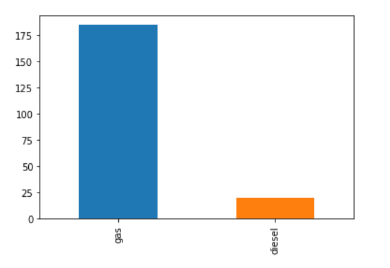
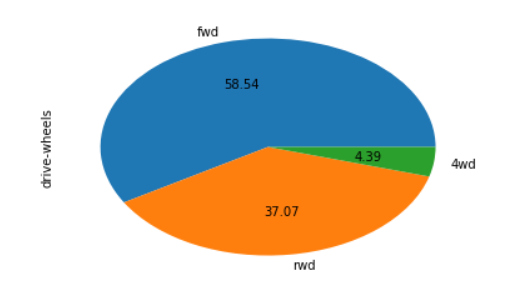
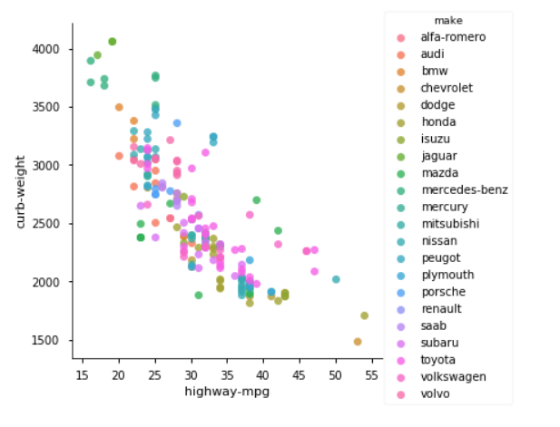
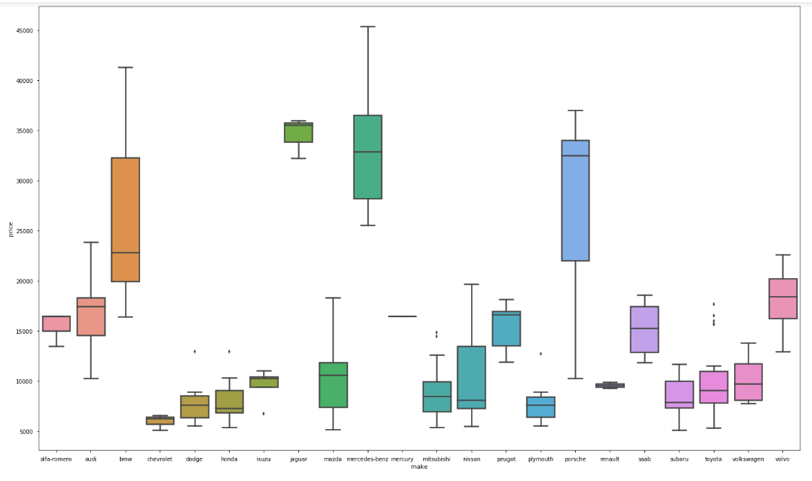

# **University of Puthisastra        Master in Information Technology** 

## **Fundamentals of Data Science Guideline for Final Project**

## 1. **Objective**

The Objective of this assignment is to conduct exploratory data analysis (EDA) on a provided dataset. This assignment will allow you to gain hands-on experience in data preprocessing, visualization, modeling, and interpretation, essential skills for a data scientist.

## 2. Task

### 2.1 **Descritive Analysis:** 

- Understand the basic statistics of the dataset such as mean, median, mode, standard deviation for numerical features, such as age or BMI etc. 
- Distribution of categorical variables, such as gender or diabetes etc. 

### 2.2 Data Exploration and Preprocessing:
  - Check for missing values (e.g., "No Info") and decide how to handle them (e.g. replace or removal) 
  - Standardize or normalize numerical features like age or BMI etc. 

### 2.3 Exploratory Data Analysis (EDA): 
  - Visualize the relationships between variables using plots, scatter, histograms, or bar. 
  - Explore the distribution of target variable, for example, "diabetes", with respect to other features. 
  - Identify any patterns or anomalies in the data. 

### 2.4 **Documentation and Reporting:** 
  - Document the entire analysis process in a Jupyter Notebook (.ipynb file). 
  - Include detailed explanations of data preprocessing and exploratory data analysis. 
  - Prepare a concise report summarizing key findings and insights.** 

## EDA-on-Automobile-Dataset
<b><ul><li>Performed EDA on a Automobile Dataset.</li><li>Used Pandas and Numpy for Data Manipulation followed by Matplotlib and Seaborn for Data Visualisation.</li><li>A starter project just to get acquainted with the libraries mentioned above.</li></ul>
  </b>

<b>Some of the visualisations and the corresponding insights:</b>

90% of the people use cars that run of gas rather than diesel

Not a lot of people have 4 wheel drive cars
  

As the weight of the car increases the mileage decrease (negative correlation,colour coded by the manufacturer of the car)

Prices of BMW,Mercedes-Benz and Porsche are very high but Porsche offers car models in a lot pf price ranges.From premium pricing to pricing comparable to top models of other car manufacturers while BMW,Mercedes-Benz have only premium segment cars.

